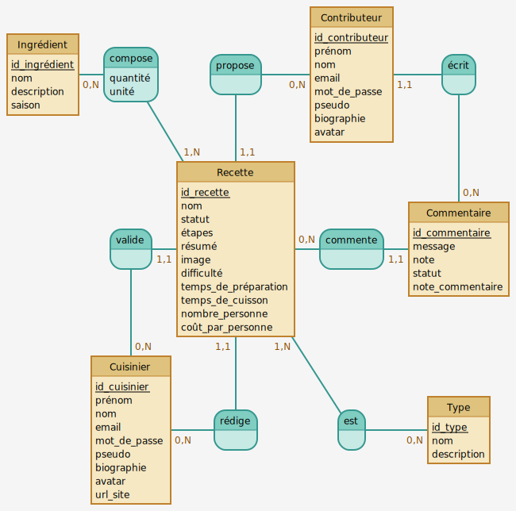
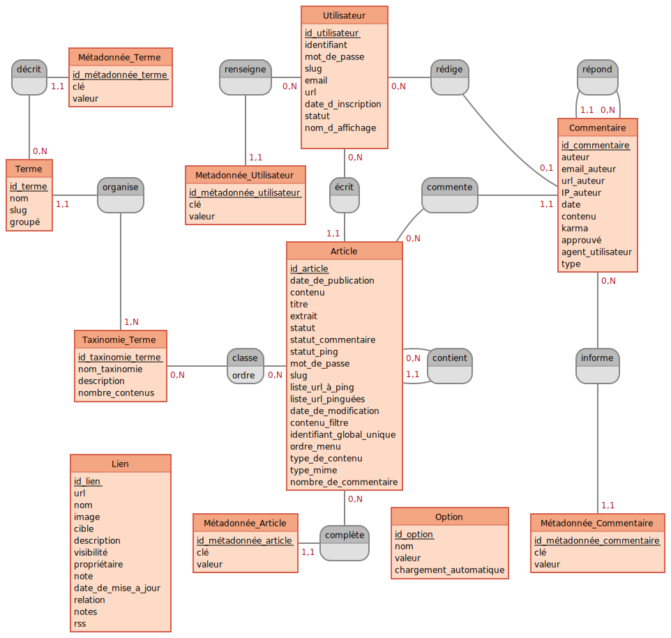

# Gestion des données avec WordPress

## Modèle conceptuel de données (MCD)

### oCooking

### WordPress

[Voir le diagramme EER MySQL](wordpress-eer.png)

---

## Entités

Nom|Table WordPress|Détail(s)
-|-|-
Commentaire|`comments`|
Contributeur|`users`|Role `clerk`
Cuisinier|`users`|Role `cook`
Ingrédient|`terms`|Taxonomy `ingredient`
Recette|`posts`|Post type `recipe`
Type|`terms`|Taxonomy `type`

---

## Propriétés (Attributs)

### Commentaire

Propriété|Table WordPress|Colonne|Détail(s)
-|-|-|-
id_commentaire|`comments`|`comment_ID`|
message|`comments`|`comment_content`|
note|̀`commentmeta`|`meta_value`|`meta_key` = `recipe_score`
statut|`comments`|`comment_approved`|
note_commentaire|`commentmeta`|`meta_value`|`meta_key` = `comment_score`

### Contributeur

Propriété|Table WordPress|Colonne|Détail(s)
-|-|-|-
id_contributeur|`users`|`ID`|
prénom|`usermeta`|`meta_value`|`meta_key` = `first_name`
nom|`usermeta`|`meta_value`|`meta_key` = `last_name`
email|`users`|`user_email`|
identifiant|`users`|`user_login`|
mot_de_passe|`users`|`user_pass`|
pseudo|`usermeta`|`meta_value`|`meta_key` = `nickname`
biographie|`usermeta`|`meta_value`|`meta_key` = `description`
avatar|||Géré par Gravatar

### Cuisinier

Propriété|Table WordPress|Colonne|Détail(s)
-|-|-|-
id_cuisinier|`users`|`ID`|
prénom|`usermeta`|`meta_value`|`meta_key` = `first_name`
nom|`usermeta`|`meta_value`|`meta_key` = `last_name`
email|`users`|`user_email`|
identifiant|`users`|`user_login`|
mot_de_passe|`users`|`user_pass`|
pseudo|`usermeta`|`meta_value`|`meta_key` = `nickname`
biographie|`usermeta`|`meta_value`|`meta_key` = `description`
avatar|||Géré par Gravatar
url_site|`users`|`user_url`|

### Ingrédient

Propriété|Table WordPress|Colonne|Détail(s)
-|-|-|-
id_ingrédient|`terms`|`term_id`|
nom|`terms`|`name`|
description|`term_taxonomy`|`description`|
saison|`termmeta`|`meta_value`|`meta_key` = `season`

### Recette

Propriété|Table WordPress|Colonne|Détail(s)
-|-|-|-
id_recette|`posts`|`ID`|
nom|`posts`|`post_title`|
statut|`posts`|`post_status`|
étapes|`posts`|`post_content`|
résumé|`posts`|`post_excerpt`|
image|̀`postmeta`|`meta_value`|`meta_key` = `_thumbnail_id` (lié à un post de type attachment)
difficulté|`postmeta`|`meta_value`|`meta_key` = `level`
temps_de_préparation|`postmeta`|`meta_value`|`meta_key` = `preparation_time`
temps_de_cuisson|`postmeta`|`meta_value`|`meta_key` = `cooking_time`
nombre_personne|`postmeta`|`meta_value`|`meta_key` = `person_count`
coût_par_personne|`postmeta`|`meta_value`|`meta_key` = `cost_per_person`

### Type

Propriété|Table WordPress|Colonne|Détail(s)
-|-|-|-
id_type|`terms`|`term_id`|
nom|`terms`|`name`|
description|`term_taxonomy`|`description`|

---

## Associations

Entité 1|Nom|Entité 2|Table WordPress|Colonne entité 1|Colonne entité 2|Détail(s)
-|-|-|-|-|-|-
`Commentaire`|commente|`Recette`|`comments`|`comment_ID`|`comment_post_ID`
`Contributeur`|écrit|`Commentaire`|`comments`|`user_id`|`comment_ID`
`Contributeur`|propose|`Recette`|`posts`|`post_author`|`ID`
`Cuisinier`|rédige|`Recette`|`posts`|`post_author`|`ID`
`Cuisinier`|valide|`Recette`|`postmeta`|`meta_value`|`post_id`|`meta_key` = `cook_id`
`Ingrédient`|compose|`Recette`|`term_relationships`|`term_taxonomy_id`|`object_id`|quantité et unité seront à gérer dans une meta de post avec la `meta_key` = `ingredient_details` (tableau multidimensionnel d'ID d'ingrédient avec quantité et unité)
`Recette`|est|`Type`|`term_relationships`|`object_id`|`term_taxonomy_id`
---
